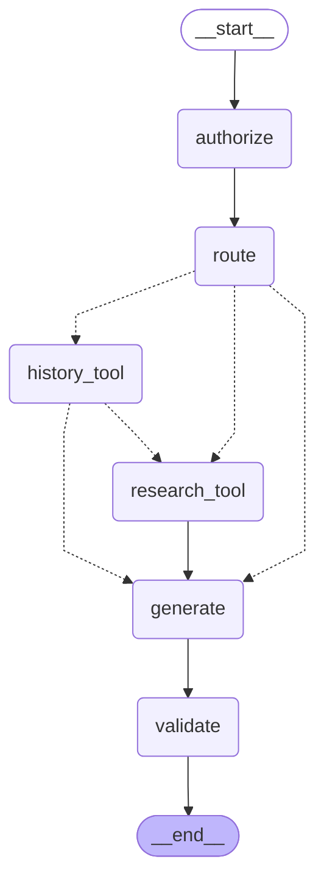

# Compiled graph

```mermaid
---
config:
  flowchart:
    curve: linear
---
graph TD;
	__start__([<p>__start__</p>]):::first
	authorize(authorize)
	route(route)
	history_tool(history_tool)
	research_tool(research_tool)
	generate(generate)
	validate(validate)
	__end__([<p>__end__</p>]):::last
	__start__ --> authorize;
	authorize --> route;
	generate --> validate;
	history_tool -.-> generate;
	history_tool -.-> research_tool;
	research_tool --> generate;
	route -.-> generate;
	route -.-> history_tool;
	route -.-> research_tool;
	validate --> __end__;
	classDef default fill:#f2f0ff,line-height:1.2
	classDef first fill-opacity:0
	classDef last fill:#bfb6fc

```
